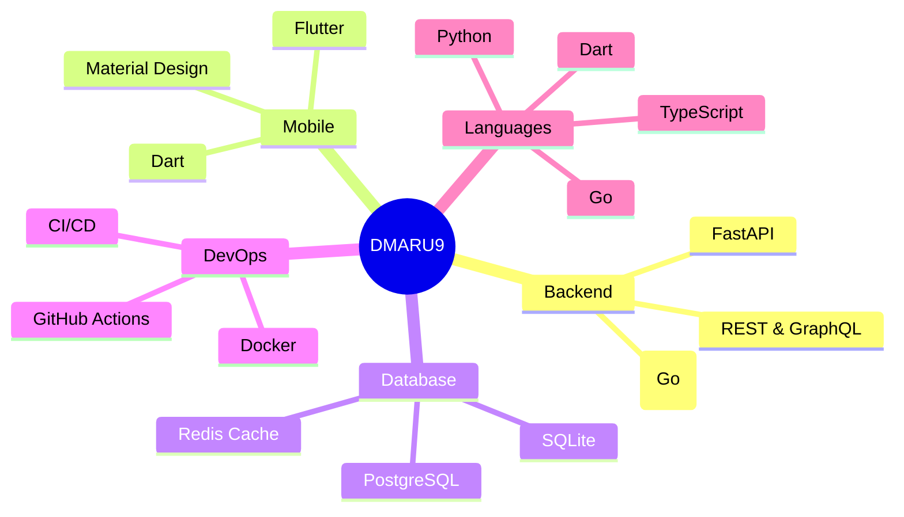

<div align="center">
  <picture>
    <source media="(prefers-color-scheme: dark)" srcset="https://raw.githubusercontent.com/DMARU9/DMARU9/output/github-contribution-grid-snake-dark.svg" />
    <source media="(prefers-color-scheme: light)" srcset="https://raw.githubusercontent.com/DMARU9/DMARU9/output/github-contribution-grid-snake.svg" />
    
  </picture>
</div>

```text
╔══════════════════════════════════════════════════════════════╗
║                                                              ║
║            █████ █   █  ███  █████ █   █ █████               ║
║            █   █ ██ ██ █   █ █   █ █   █ █   █               ║
║            █   █ █ █ █ █████ █████ █   █ █████               ║
║            █   █ █   █ █   █ █  █  █   █     █               ║
║            █████ █   █ █   █ █   █  ███  █████               ║
║                                                              ║
╚══════════════════════════════════════════════════════════════╝
```

<p align="center">
  
</p>

<p align="center">
  <a href="https://github.com/DMARU9"></a>
  <a href="https://github.com/DMARU9?tab=followers"></a>
  <a href="https://github.com/DMARU9?tab=stars"></a>
</p>

---

## 🧑‍💻 About Me

```yaml
api_version: v1
kind: Profile
metadata:
  name: DMARU9
  namespace: github.com
  labels:
    tech: [python, dart, go, typescript]
    focus: [backend, mobile, api]
spec:
  location: Japan 🇯🇵
  stacks:
    backend:
      - Python (FastAPI)
      - Go (Gin)
      - Node.js
    mobile:
      - Flutter / Dart
      - Cross-platform
    database:
      - PostgreSQL
      - Redis
      - SQLite
    tools:
      - Docker
      - Git
      - CI/CD
  status:
    learning: Go, System Design, Clean Architecture
    building: Next-gen API platform with FastAPI + PostgreSQL
    goal: "Ship quality code that makes a difference 🚀"
```

---

## 🛠️ Tech Stack

<div align="center">

### 🎯 Core Technologies


### 📊 Stack Breakdown



</div>

---

## 📊 GitHub Analytics

<div align="center">

| Stats | Top Languages | Streak |
|:-----:|:-------------:|:------:|
|  |  |  |

</div>

### 📈 Profile Summary

<div align="center">


| | | |
|:--:|:--:|:--:|
|  |  |  |

</div>

---

## 🏆 GitHub Achievements

<div align="center">


[](https://github.com/DMARU9)

> 💡 _The trophy service (`github-profile-trophy`) is currently unavailable due to a deployment issue. Above stats are shown as an alternative._

</div>

---

## 🌱 Weekly Development Breakdown

<!--START_SECTION:waka-->
```text
No activity data yet. Start coding to fill this section! 🚀
```
<!--END_SECTION:waka-->

---

## ⚡ Recent GitHub Activity

<!--START_SECTION:activity-->
1. 🎉 Merged PR [#1](https://github.com/DMARU9/DMARU9/pull/1) in [DMARU9/DMARU9](https://github.com/DMARU9/DMARU9)
<!--END_SECTION:activity-->

---

## 🚀 Featured Projects

> 🏗️ _Projects coming soon! Stay tuned for some exciting work in backend APIs, mobile apps, and more._

<div align="center">

| | | |
|:-:|:-:|:-:|
| **Coming Soon** | **Coming Soon** | **Coming Soon** |
| ✨ | ✨ | ✨ |

</div>

---

## 🎯 Current Focus

```text
🎯 Current:  Scalable APIs with FastAPI + PostgreSQL
📚 Learning: Go backend development with Gin framework
🔭 Exploring: System Design & Clean Architecture
```

---

## 📫 Let's Connect

<div align="center">

[](https://github.com/DMARU9)

</div>

---

<div align="center">

```
  ╭──────────────────────────────────────────────────╮
  │                                                  │
  │   💻  Built with passion by DMARU9              │
  │   ⭐  Thanks for visiting!                       │
  │   🐍  "Simple is better than complex."           │
  │                                                  │
  ╰──────────────────────────────────────────────────╯
```


</div>
